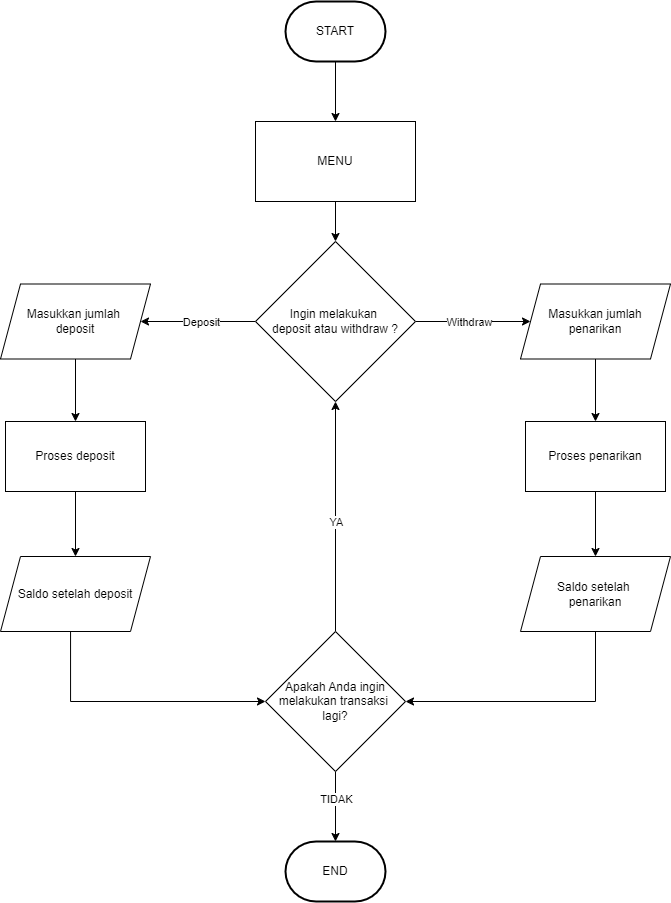

# Bank Account System

Berikut adalah program mengenai sistem bank. Pada repository ini terdapat 2 file program yaitu :

- File bank_account.js yang berguna untuk menjalankan perintah deposit dan withdraw
- File banking_system.js yang berguna untuk menjalankan perintah utama dari keseluruhan program yang sudah dibuat

## Cara Menjalankan Program

Berikut adalah cara menjalankan program :

- Navigasi ke direktori proyek tempat file tersebut disimpan menggunakan terminal.
- Jalankan program dengan perintah: node banking_system.js
- Nanti akan muncul beberapa pertanyaan dari program yang sudah dibuat

## Flowchart Program

## ERD

